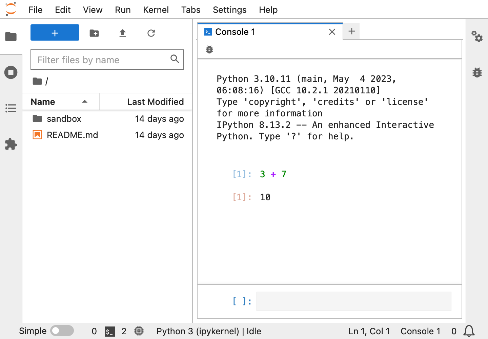

What is Python?
===============

Introduction to Python
----------------------

Python is a programming language. Just like there are many different spoken languages, there are many different programming languages. Similar to how each spoken language is used by a subset of the humans on this Earth, each programming language was created for a different group of people who code. You may have heard of other programming languages, such as C++, Java, or R. These are all enormously popular programming languages, but each has what it does best along with its own disadvantages. For example, if you're interested in building software that runs really quickly, you may learn C++. Java may be most helpful if you want to build video games.

Initially released in 1991, Python has developed into a mature general purpose programming language. It has become the standard language for data analysis in industry. Any program you can think of you can probably write in Python. But, like other languages, Python has its strengths and weaknesses. In its simplest form, Python receives instructions, executes these instructions, and returns the results. For example, it can be used as a simple calculator. If you type :code:`3 + 7` in the Python console and press :kbd:`Shift-Enter`, Python will tell you that the answer is 10.

>>> 3 + 7
10

Throughout this course, we will use lines starting with :code:`>>>` to indicate instructions we give to Python (:code:`3 + 7` above) and lines without :code:`>>>` to show results (:code:`10` above).

Python also has the ability to work with data, such as the information in spreadsheets. It can to tell you how many rows are in your column, find the average age of individuals across a dataset, and create plots to show you how many males or females are included in your dataset. Beyond data summary, you can run statistical analyses, write your own software, and carry out complicated analyses start to finish in Python.

Jupyter Lab
-----------

`Jupyter Lab <https://jupyter.org>`__ makes data analysis in Python easier. It is a free, interactive interface for software development and data analysis in Python. Jupyter Lab has many features which we will explore successively in this course. Briefly, it lets you write code, provides an interface to run the code, and develop notebooks. Notebooks are often used by data scientists because they let you combine code, graphics, and documentation. Documentation is important for both yourself so you can remind yourself of the analysis you did a while ago and for others if they want to build on your results. All of these features are accessible through your browser, simplifying programming and data analysis.

Jupyter Lab in the Cloud
------------------------

`Codespaces <https://github.com/features/codespaces>`__ is a computing environment to run code in the cloud. We have configured Codespaces so you can use Jupyter Lab in the cloud. This means that regardless of what computer you're on, you can return to the analysis you were doing previously. We will briefly explore Jupyter Lab on Codespaces to run your first lines of Python code.

1. Open the `Codespaces settings <https://github.com/settings/codespaces>`__ on GitHub. If the link doesn't work, make sure you're logged in.
2. Scroll to the "Editor preferences" section, and select "JupyterLab".

3. Launch a new Codespace by clicking `here <https://codespaces.new/tillahoffmann/datatrail-python?quickstart=1>`__ and wait for the Codespace to load; this could take a minute or two. You should see a JupyterLab window as shown below.

4. Scroll down to "Console" in the main panel and click on "Python 3 (ipykernel)". This will launch a new console which you can use to give Python instructions, such as the calculator example above.

Learning Python
---------------

Learning Python can be difficult and frustrating. If you get stuck, you're definitely not alone! The Internet and conversations with others can be very helpful.

.. image:: https://imgs.xkcd.com/comics/wisdom_of_the_ancients.png
    :target: https://www.explainxkcd.com/wiki/index.php/979:_Wisdom_of_the_Ancients

We just wanted to take a second to remind you that getting frustrated is normal. Data scientists fail all the time; it is part of the processing of learning and exploring the data. The goal here is to *learn* how to use Python, *not* to memorize functions (there are too many functions for this to even be possible and new ones are created all the time). So try things out on your own. Try to work through error messages when you're stuck. But, if you can't figure it out, ask questions of others who have more experience than you! For example, `StackOverflow <https://stackoverflow.com>`__ is a great resource for overcoming hurdles.
