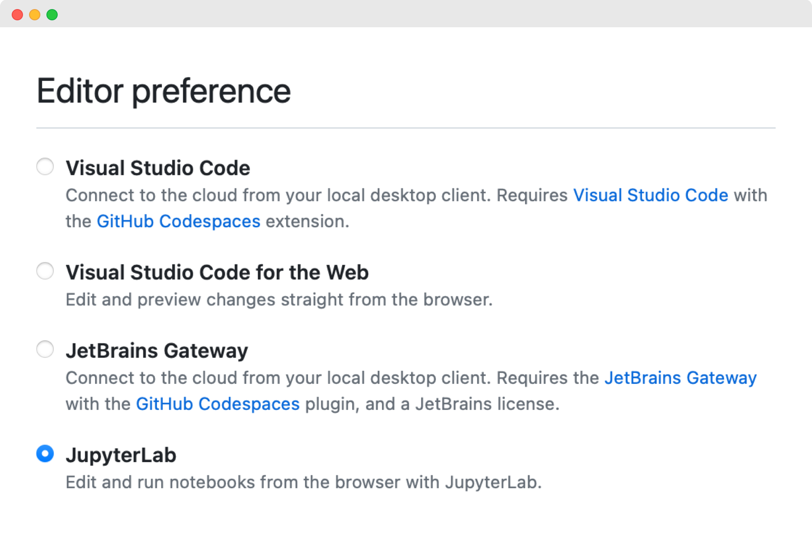
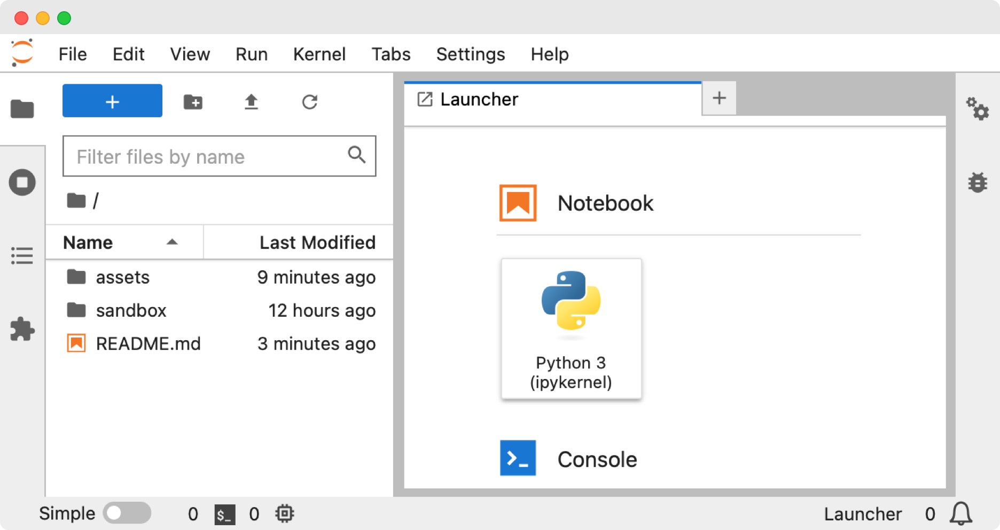

# 🐍 DataTrail in Python

## Getting started

You can get started with GitHub Codespaces in three easy steps:

1. Open the [Codespaces settings](https://github.com/settings/codespaces), scroll to the "Editor preferences" section, and select "JupyterLab".

2. Launch a new Codespace by clicking [here](https://codespaces.new/tillahoffmann/datatrail-python?quickstart=1) and wait for the Codespace to load; this could take a minute or two. You should see a JupyterLab window as shown below.

3. Click on `sandbox` and double click on `apple_sales.md` in the left panel to open the [example notebook](sandbox/apple_sales.md).
